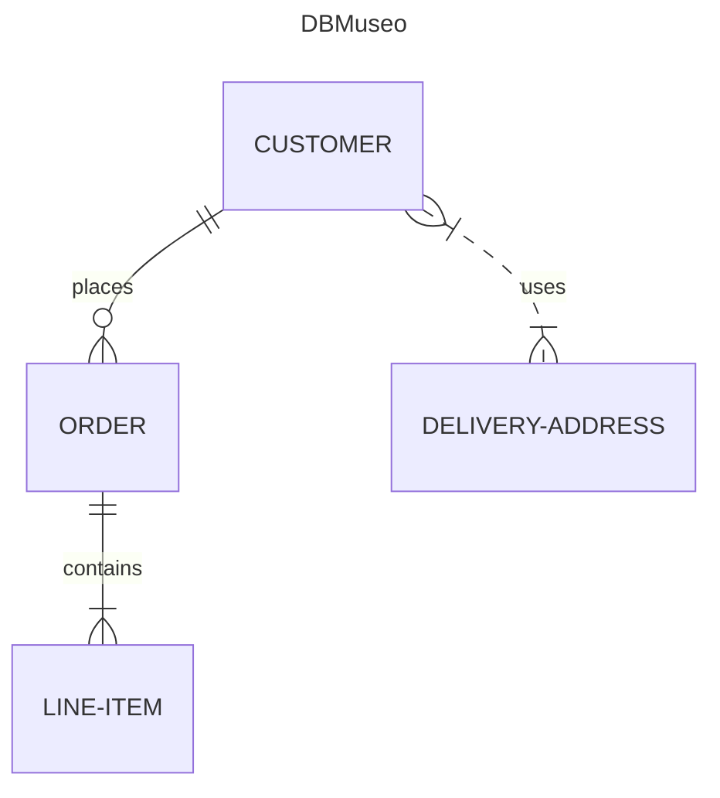

#Leggenda E-R
<table>
   <thead>
      <tr>
         <th style="text-align:center;">Value (left)</th>
         <th style="text-align:center;">Value (right)</th>
         <th>Meaning</th>
      </tr>
   </thead>
   <tbody>
      <tr>
         <td style="text-align:center;"><code>|o</code></td>
         <td style="text-align:center;"><code>o|</code></td>
         <td>Zero or one</td>
      </tr>
      <tr>
         <td style="text-align:center;"><code>||</code></td>
         <td style="text-align:center;"><code>||</code></td>
         <td>Exactly one</td>
      </tr>
      <tr>
         <td style="text-align:center;"><code>}o</code></td>
         <td style="text-align:center;"><code>o{</code></td>
         <td>Zero or more (no upper limit)</td>
      </tr>
      <tr>
         <td style="text-align:center;"><code>}|</code></td>
         <td style="text-align:center;"><code>|{</code></td>
         <td>One or more (no upper limit)</td>
      </tr>
   </tbody>
</table>

