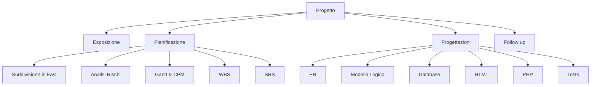

# WBS (Work Breakdown Structure)
---

```mermaid
flowchart TD
Progetto
Progetto --> A[Esposizione]
Progetto --> B[Pianificazione]
Progetto --> C[Progettazion]
Progetto --> D[Follow up]
B --> Fasi[Suddivisione in Fasi]
B -->Rischi[Analisi Rischi]
B --> E[Gantt & CPM]
B -->F[WBS]
B --> G[SRS]
C --> H[ER] 
C --> I[Modello Logico]
C --> L[Database]
C --> M[HTML]
C --> N[PHP]
C --> O[Tests]

```
